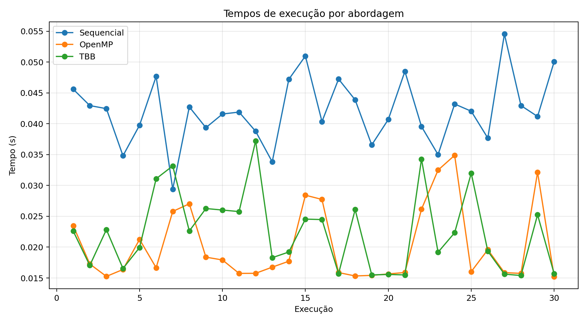
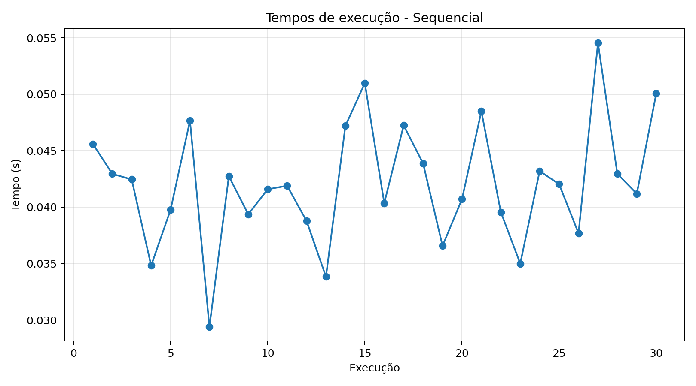
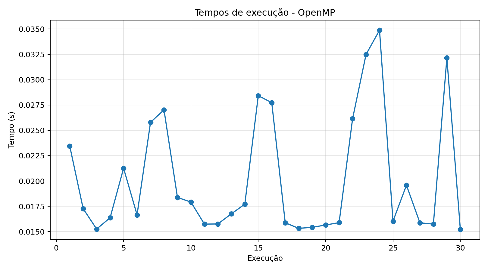
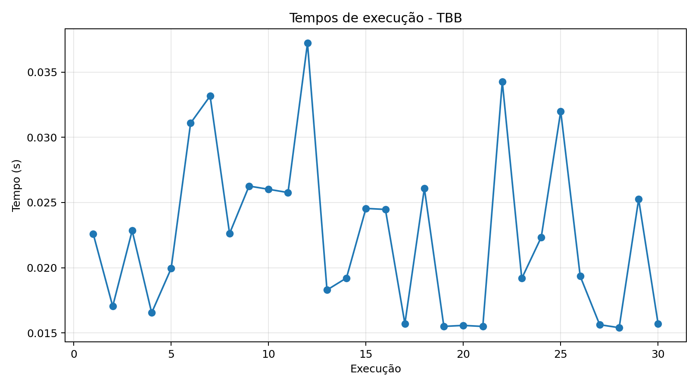

# Relatório técnico — soma de vetor com C++, OpenMP e TBB

## 1. Introdução
Este experimento compara três formas de somar os elementos de um vetor grande em C++: uma implementação sequencial, uma implementação paralela com OpenMP e uma implementação paralela com Intel TBB. O objetivo é observar o impacto da paralelização no tempo de execução e avaliar a estabilidade dos resultados por meio da média e do desvio padrão das medições.

## 2. Metodologia
O vetor utilizado possui 100,000,000 elementos inteiros. Cada posição foi inicializada com o valor 1, permitindo validar o resultado esperado da soma antes de registrar cada medição. Foram executadas 30 medições por abordagem. O tempo foi medido dentro do programa em C++ com `std::chrono::steady_clock`, registrando apenas o trecho responsável pela soma.

As versões paralelas foram implementadas com redução: em OpenMP, por meio da diretiva `#pragma omp parallel for reduction(+:sum)`; em TBB, por meio de `tbb::parallel_reduce`. O número de threads reportado pelo programa foi 3. Os dados brutos foram gravados em CSV e analisados em Python.

Ambiente de análise do relatório:

- Sistema: Linux-6.8.0-47-generic-x86_64-with-glibc2.39
- Python: 3.12.3

## 3. Resultados
| Abordagem | Execuções | Média (s) | Desvio padrão (s) | Mínimo (s) | Máximo (s) | Speedup |
|---|---:|---:|---:|---:|---:|---:|
| Sequencial | 30 | 0.042079 | 0.005446 | 0.029392 | 0.054537 | 1.00x |
| OpenMP | 30 | 0.020261 | 0.006075 | 0.015218 | 0.034884 | 2.08x |
| TBB | 30 | 0.022501 | 0.006314 | 0.015401 | 0.037220 | 1.87x |

### Gráficos

## 4. Discussão
A versão paralela mais rápida, considerando a média das execuções, foi OpenMP, com speedup médio de 2.08x em relação à versão sequencial. Em geral, a soma de um vetor grande tende a ser limitada pela largura de banda de memória: depois que a CPU passa a ler dados mais rapidamente do que a memória consegue entregar, adicionar mais threads nem sempre produz ganhos proporcionais. Por isso, a análise considera não apenas o menor tempo observado, mas principalmente a média e o desvio padrão ao longo das 30 execuções.

Diferenças entre OpenMP e TBB podem ocorrer por causa do escalonamento das tarefas, do custo de criação e sincronização das threads e da forma como cada biblioteca divide o trabalho. Como a operação de soma é simples, o custo de coordenação pode ter peso relevante, principalmente quando a máquina possui poucos núcleos ou quando outros processos competem por CPU e memória.

## 5. Conclusão
O experimento mostra como a paralelização pode reduzir o tempo de execução de uma tarefa simples e intensiva em leitura de memória, mas também evidencia que o ganho depende do ambiente de execução e do custo de coordenação das threads. A versão sequencial serve como base de comparação, enquanto OpenMP e TBB mostram duas estratégias práticas para explorar paralelismo em C++.
